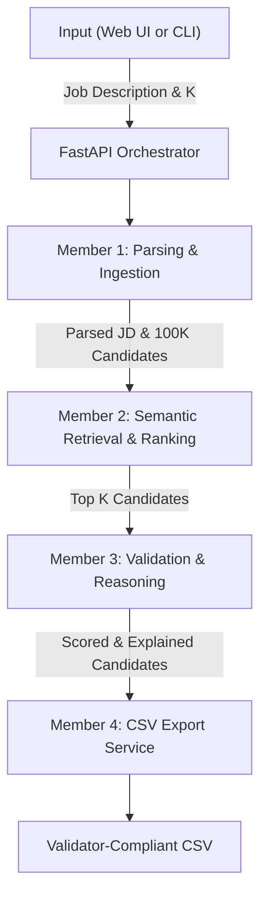

# India Runs Data & AI Challenge - System Architecture

This document describes the modular end-to-end architecture for the Intelligent Candidate Discovery pipeline.

## 1. High-Level Flow
The pipeline follows a synchronous, modular data flow orchestrated by the FastAPI backend (Member 4), which invokes distinct processing stages handled by the logic built by Members 1, 2, and 3.

## 2. Component Breakdown

### Member 1: Ingestion & Parsing (`modules/member1_parsing/`)
**Responsibilities**:
- Ingest the raw `candidates.jsonl` dataset (approx. 487MB, 100K records).
- Parse the complex nested JSON into standard dictionary schemas.
- Parse the raw Job Description text into structured requirements (`required_skills`, `min_experience_years`).

### Member 2: Retrieval & Ranking (`modules/member2_ranking/`)
**Responsibilities**:
- Compute dense embeddings for candidate profiles and JD.
- Perform fast vector search (e.g. FAISS).
- Run a Learning-to-Rank (LTR) model (LightGBM, CatBoost) to re-rank the top retrieved candidates.
- *Constraint Note:* Must execute offline within the CPU time limit. Currently implemented as a fast heuristic keyword-matcher for E2E testing.

### Member 3: Validation & Reasoning (`modules/member3_validation/`)
**Responsibilities**:
- Review the top candidates and generate human-readable `reasoning` explanations.
- Flag any "honeypot" traps or impossible profiles (e.g. 50 years experience in a 10-year-old framework).
- Emit the `final_score` used for sorting the CSV.

### Member 4: Orchestration & UI (`orchestrator/` & `submission/`)
**Responsibilities**:
- Provide the CLI (`rank.py`) and FastAPI Dashboard (`orchestrator/main.py`).
- Stitch the pipeline together passing data state (`RunResult`).
- Ensure the exported CSV strictly adheres to the Hackathon 100-row format.
